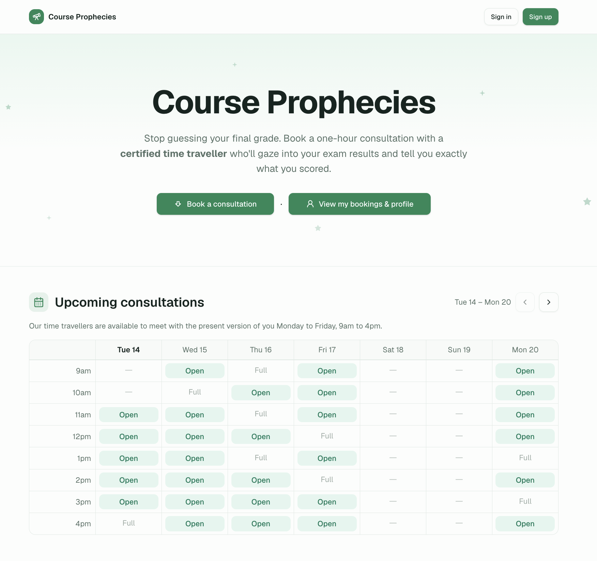
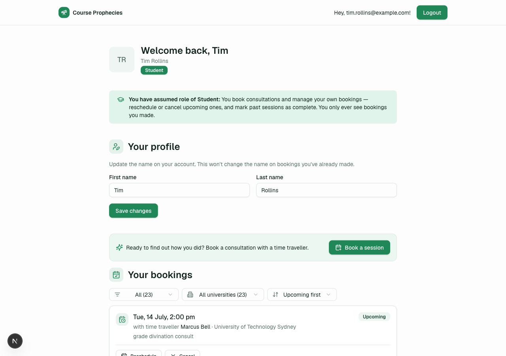
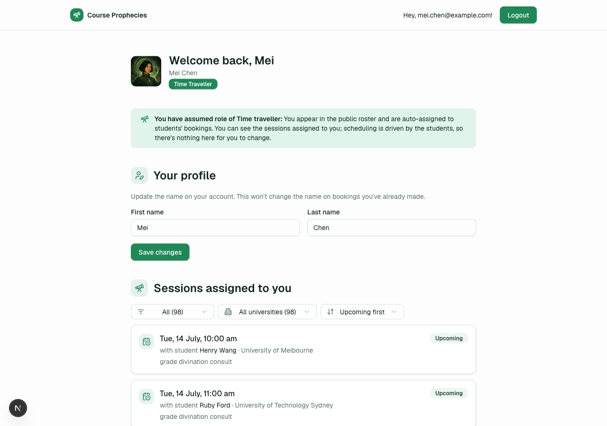
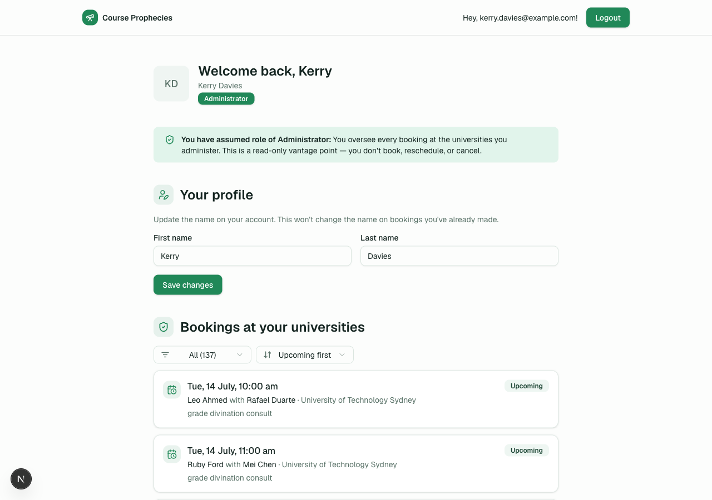
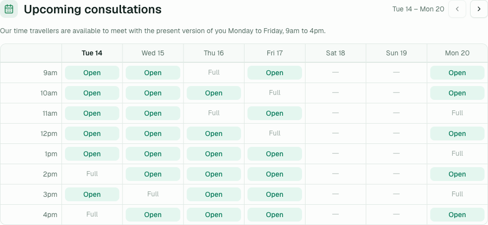
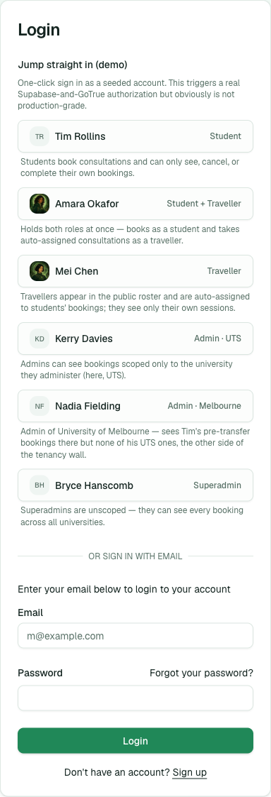
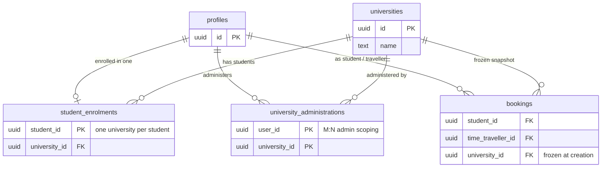

# 🔮 Course Prophecies

[](https://github.com/brycehans/lms/actions/workflows/ci.yml)



**Course Prophecies** is a
mini-LMS with a twist: instead of tutors, students book one-hour consultations
with **certified time travellers** who go into the future to find out your grade
then come back to the present and tell you how you scored.

It happens in three steps:


1. **Book a consultation.** Pick an open slot and hand over your course details.
2. **They travel to the future.** A traveller slips through a swirling green
   portal to the day your exam results go up.
3. **They report back.** They return with the prophecy — your grade, revealed.

> [!NOTE]
> **Live demo:** a hosted version runs at
> [lms.brycehanscomb.com](https://lms.brycehanscomb.com). The one-click persona
> logins sit behind a site-wide HTTP Basic Auth gate (see [Deploy](#deploy)).

It's a real multi-tenant scheduling app: four personas,
role-scoped views, a full booking lifecycle, and an engine that refuses to
double-book any traveller across space _or_ time. Built on Next.js (App Router) +
local Supabase (Postgres 17) in Docker — and yes, the dev server runs on port
**1955** on purpose.


## What it does

- **Students** consult the emerald availability calendar, book a session into a
  valid business-hours slot, and manage it afterwards — reschedule, cancel, or
  mark a prophecy fulfilled. Each booking auto-assigns a free traveller.

  

- **Travellers** (some students moonlight as one) see the sessions foretold to
  them.

  

- **Admins** watch over the consultations at the universities they administer;
  **superadmins** see every timeline. Both views are read-only and scoped by RLS.
  (The brief's Admin — a single role that sees every consultation across the
  entire system — is the **superadmin** here; the university-scoped admin is an
  extra tier showing how roles compose with tenancy.)

  

- **Everyone** gets the usual auth surface: sign-up (which captures name +
  university and enrols the user as a student in one step), login, password
  reset, and a self-service profile edit.

The public landing page doubles as a directory — the traveller roster, the
participating universities, and the week's open slots — with one-click demo
logins for each persona.



> [!TIP]
> **Deep-linkable slots that survive login.** Every open slot on the calendar is
> a real link — `/book?start_at=<ISO timestamp>` — that preloads the booking form
> with that time already selected. If a user has to sign in first, the session will remember the booking time they asked for when returning from login to the booking form.

## Security Model

This is a deliberately server-mediated Supabase app (not the
default client-writes pattern), and the whole design turns on one rule — see
[Architecture](#architecture).

## Quick start

One command on a fresh clone — needs Docker running and `pnpm` installed:

```bash
./scripts/setup.sh
```

It checks prerequisites, installs dependencies, brings up a fully seeded local
Supabase stack (`supabase start` + `db reset`), and launches the dev server. Or
run the steps yourself:

```bash
pnpm install
pnpm dev        # boots local Supabase (docker) + next dev, wired together
```

Local dev needs **no** env file: `pnpm dev` (`scripts/dev.mjs`) reads the running
stack's URL + publishable key live and defaults the demo-login flags. Copy
`.env.example` to `.env.local` only to override something (e.g. to point the local
app at a hosted Supabase).

To go the other way — back to a fresh-clone state — run `pnpm teardown`. It stops
the Supabase stack (discarding the db volumes), then removes derived state
(`node_modules`, `.next`, local env files, Supabase caches); `pnpm install && pnpm dev`
rehydrates from scratch. It prompts before deleting; `--dry-run` previews,
`--yes` skips the prompt, `--keep-env` preserves your `.env`/`.env.local`.

- App: [localhost:1955](http://localhost:1955)
- Supabase Studio: [localhost:54323](http://localhost:54323) · API on `:54321` · db on `:54322`

> [!TIP]
> **Quick-login (demo).** The sign-in page shows a one-click panel above the
> email form — one button per seeded persona (student, student+traveller,
> traveller, two scoped admins, and a superadmin). Each button runs a **real**
> Supabase sign-in (no impersonation backdoor), so sessions, cookies, and RLS
> behave exactly as a normal login.



### Useful commands

```bash
pnpm typecheck                 # tsc --noEmit — the reliable pre-commit gate
pnpm test                      # unit (vitest) + pgTAP DB suite + slot-lock contention
pnpm build                     # next build
pnpm teardown                  # stop stack + wipe db + remove derived files → fresh-clone state
pnpm supabase db reset         # drop, re-run ALL migrations, then seed.sql (local rebuild)
pnpm supabase migration new X  # scaffold a timestamped migration
```

## Test Coverage

- **pgTAP suite** exercises the RLS read policies and every RPC's invariants under a role-impersonation rig;
- **two-session shell test** covers the per-slot advisory lock's concurrency behaviour;
- **vitest** covers API route contracts

## Architecture

One rule everything follows:

- **Reads**: Server Components call the Supabase SDK directly. **RLS policies**
  scope what each role sees — there is no hand-written read authz in the app layer.
- **Writes**: go through **Next.js API Route Handlers** that call `SECURITY
DEFINER` **RPCs**. This is the _only_ client-writable surface. There are
  deliberately **no INSERT/UPDATE/DELETE RLS policies** on the tables — mutation
  is impossible except through a vetted RPC.

Because RPCs run as definer (bypassing RLS), each one enforces its own invariants
internally: `auth.uid()` checks, busy-checks, business-hours domain types, a
per-slot advisory lock, and re-validation of anything a client could forge. RLS
only governs reads.

### Three Postgres schemas

- `public` — tables + the RPCs (exposed via PostgREST). RPCs are
  `revoke execute … from public, anon` then `grant execute … to authenticated`.
- `private` — helpers used inside RLS policies and RPCs (`is_person_busy`,
  `find_assignable_traveller`, `admin_university_ids`, `business_tz`, …). Not in
  PostgREST's exposed schema list, so nothing here gets a REST endpoint.
- `auth` — Supabase's. On signup a `SECURITY DEFINER` trigger (`handle_new_user`)
  reads `raw_user_meta_data` and creates the `profiles` row, student role, and
  enrolment — so the app never inserts profiles directly, and role is hardcoded
  server-side so signup can't self-promote.

### Domain model

- `profiles` — the app's user table (soft-deletable via `deleted_at`).
- `user_roles` — `(user_id, role)` junction. Roles live **outside** `profiles`
  precisely so the profile self-update policy can't be used to self-elevate.
- `bookings` — student ↔ traveller at a `starts_at` slot. `university_id` and the
  student name are **frozen snapshots at creation** (a later rename/transfer must
  not rewrite history). `cancelled_at` / `completed_at` are minted server-side.
- `student_enrolments`, `universities`, `university_administrations` — tenancy.

### Tenancy model

Universities are the tenant boundary. A student is enrolled in **exactly one**
university (the `student_enrolments` primary key is `student_id`, so a second
enrolment is impossible), while an admin can administer **many** universities and
a university can have **many** admins (the `university_administrations` composite
primary key makes it a true many-to-many). Every booking freezes its
`university_id` at creation, so oversight and history stay tenant-scoped even if a
student later transfers.



Booking slots are enforced at the **type level** by custom domains:
`top_of_hour` → `business_hours` (9am–4pm, Australia/Melbourne) →
`is_bookable_start_time` (Mon–Fri). `create_booking` also assigns a random free
traveller, takes a `pg_advisory_xact_lock` on the slot to close a both-roles
double-booking race, and enforces "can't be in two places at once".

## Design tradeoffs (flagged in code)

Spots where a deliberate call was made and the road-not-taken is worth a
conversation. Each is marked with a `TRADEOFF OPPORTUNITY` comment in the source
(`grep -rn "TRADEOFF OPPORTUNITY"`) so reviewers can jump straight to them:

- **Read via an RLS policy, not an RPC.** A student reads their _own_ enrolment
  row through a plain `select` RLS policy rather than a `SECURITY DEFINER` RPC.
  RPCs are reserved for reading rows you aren't party to; your own row is fine to
  expose directly — the read/write split in action.
  (`supabase/migrations/20260713022258_read_own_enrolment.sql:1`)
- **Idempotent cancellation.** `cancel_booking` just (re)stamps `cancelled_at`,
  so cancelling twice is harmless — but the _first_ cancellation time isn't
  preserved. The RPC is `SECURITY DEFINER` precisely so only `cancelled_at` can
  change; a table-level write policy would let PostgREST expose every column.
  (`supabase/migrations/20260712110829_cancel_booking.sql:3`)
- **Greeting from the JWT, not the DB.** With email confirmation off, signup
  leaves the user logged in and the name they entered rides in the JWT's
  `user_metadata`, so the success page greets them with no DB round-trip — at the
  cost of a slightly awkward claims lookup on the front end.
  (`app/auth/sign-up-success/page.tsx:26`)

## Known limitations (by design, for this take-home)

- **Completion is past-only (an assumption).** The brief's "mark consultations
  complete/incomplete" is read as applying to sessions that have already
  happened: `set_booking_completion` rejects future bookings (`starts_at >
  now()`) and cancelled ones — a prophecy can't be marked fulfilled before the
  consultation occurs. The UI accordingly only offers the toggle on past,
  non-cancelled bookings.
- **Hardcoded business timezone.** `Australia/Melbourne` is baked into the
  `business_hours` domain. Runtime slot logic is timezone-safe (routed through
  `private.business_tz()`), but the domain type still assumes a whole-hour UTC
  offset — the one documented spot that would need a migration to move to a
  fractional-hour zone.
- **Soft delete only.** `deleted_at`; no hard delete / GDPR erasure path.
- **No CI yet.** The gates exist and pass — `pnpm typecheck`, `pnpm lint`, and
  `pnpm test` (vitest route contracts + the pgTAP RLS/RPC suite + the two-session
  slot-lock regression) — but nothing runs them automatically on push. The DB
  tiers also need the local Supabase stack up, so wiring them into CI means
  standing up Postgres in the pipeline (or pointing `test:db` at an ephemeral
  linked project). Coverage is deliberately weighted to the backend security
  model; the front end is not under test.
- **Errors can surface as empty states.** The `/me` account sections use
  `data ?? []`, so an RLS/connection/schema failure reads as "no bookings/roles"
  rather than an explicit failure — a correctness/observability gap.
- **Booking lists are unpaginated.** The account views fetch their full booking
  collection; PostgREST caps responses at `max_rows = 1000`
  (`supabase/config.toml`), so a large admin/superadmin view would silently
  truncate.
- **Foreign keys are unindexed.** Beyond the active-slot partial unique indexes,
  `bookings.student_id / time_traveller_id / university_id` and the
  lifecycle/ordering columns have no supporting indexes — fine at demo scale.
- **Availability scales multiplicatively.** `list_available_slots` walks
  slots × travellers with a per-candidate busy-check (bounded by a 60-day clamp);
  a set-based rewrite would be the real fix.
- **Dependencies pinned loosely.** Runtime deps use `"latest"` ranges (the frozen
  lockfile keeps deploys reproducible), there is one moderate transitive PostCSS
  advisory via Next, and `.mcp.json` runs a dev tool via `npx -y`.
- **Hand-rolled Basic Auth gate on the demo.** Vercel's built-in password
  protection would be the cleaner way to gate the hosted demo, but it isn't
  available on the free Vercel plan — so the demo rolls its own site-wide HTTP
  Basic Auth gate in `proxy.ts` instead.

These last ones map to findings #6–#10 and #12 in
`docs/codebase-review-2026-07-13.md`; the verified triage and what was fixed are
in `docs/codebase-review-2026-07-13-response.md`.

## Deploy

Local Supabase (`127.0.0.1:54321`) is unreachable from a hosted deploy. See
`deploy-prep.md` for the Vercel path (hosted Supabase + `db push` + env vars +
auth redirect URLs). The public demo enables the one-click logins behind a
site-wide HTTP Basic Auth gate (`DEMO_BASIC_AUTH`, enforced in `proxy.ts`) so the
published demo credentials only reach reviewers who clear the gate.
